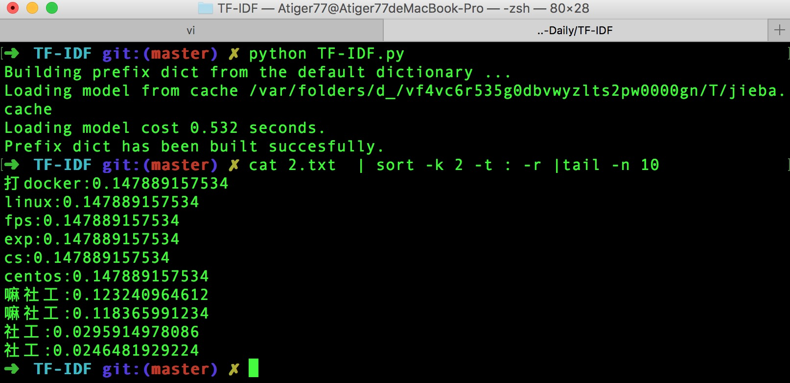

#TF-IDF
##没事玩玩机器算法，取个中文词频。感谢问吧厉厉同学指点。
> 参考：http://www.tuicool.com/articles/feIji2
        https://github.com/fxsjy/jieba
        http://blog.csdn.net/zhb_bupt/article/details/40985831

###open的文件名改成对应自己的即可，分词那边可以改成open一个文件，我这个脚本就是测试玩玩的量级很小。
###MAC下需要安装部分依赖：pip install scikit-learn jieba numpy scipy

